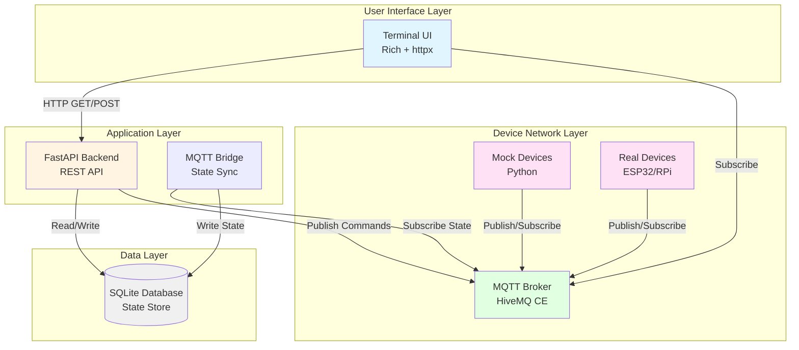
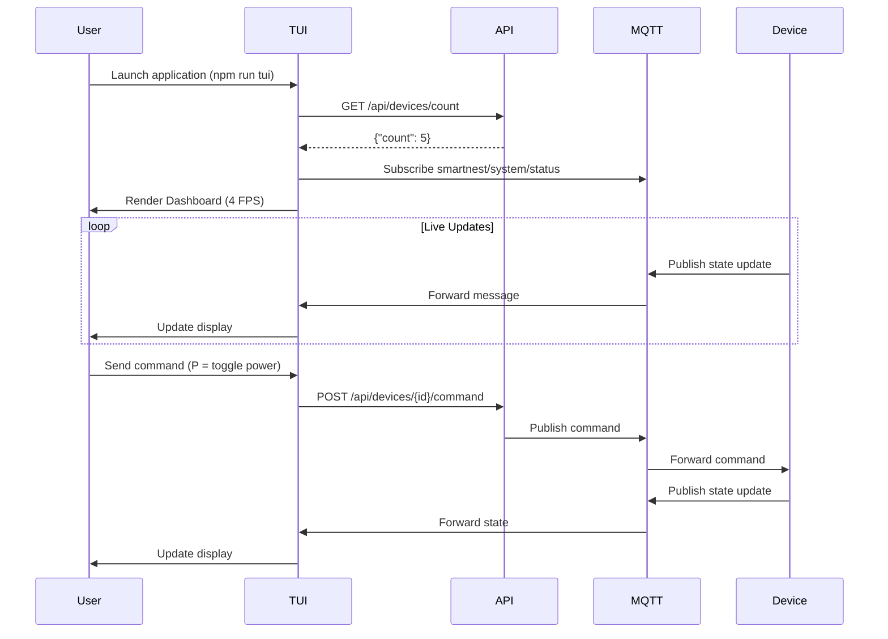
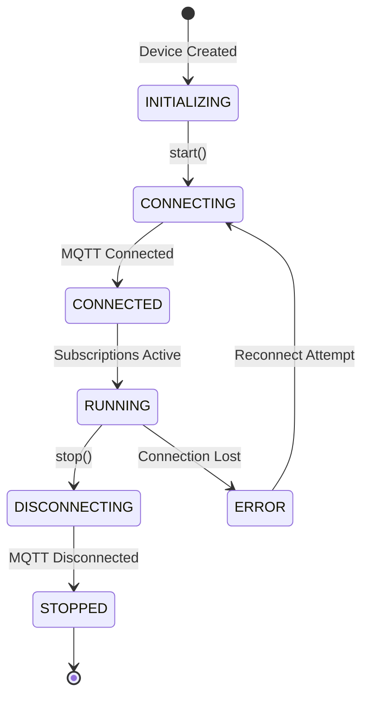
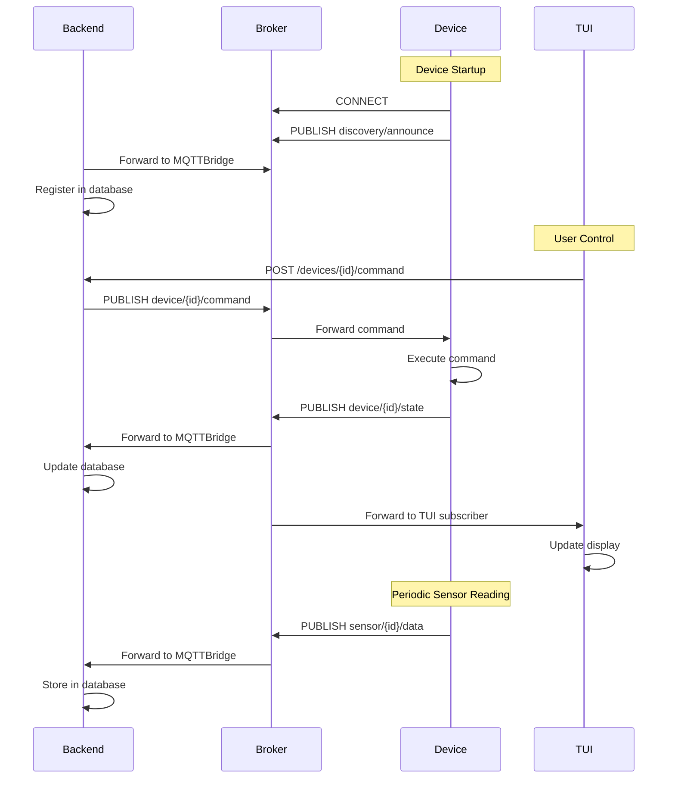
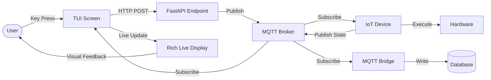
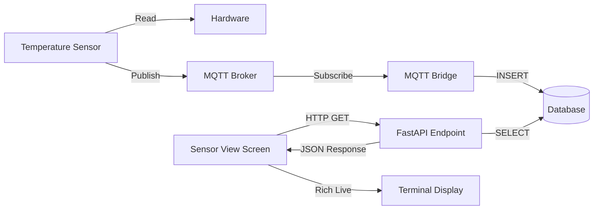
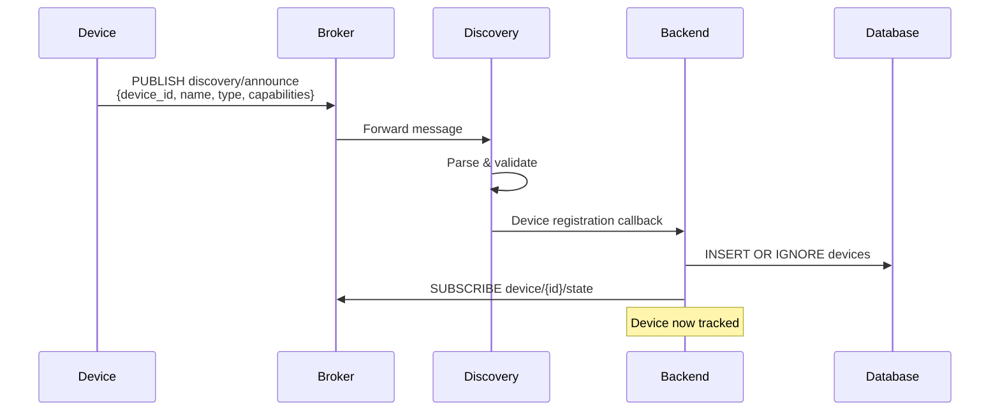
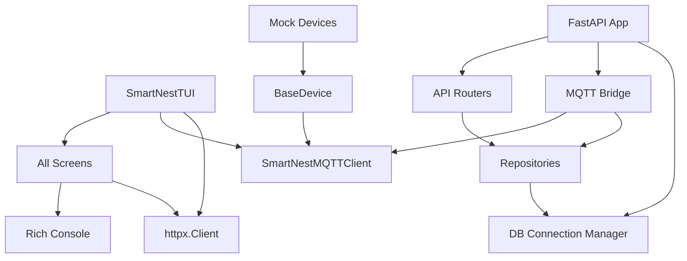
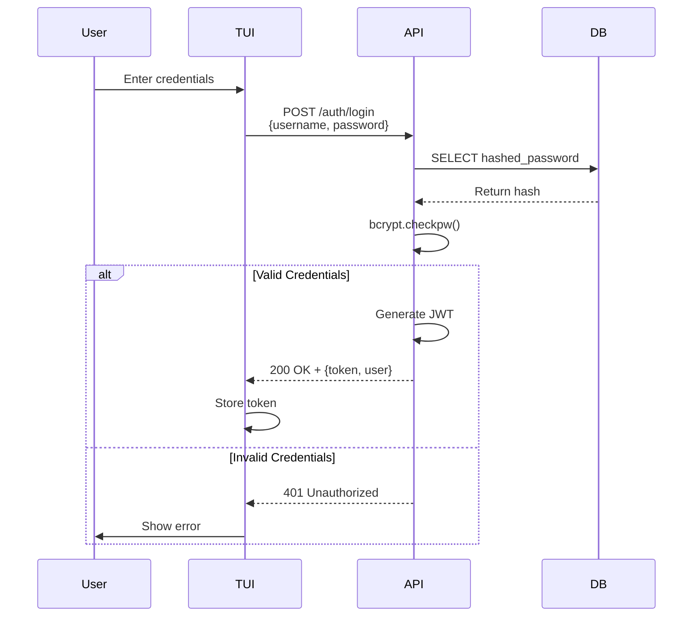
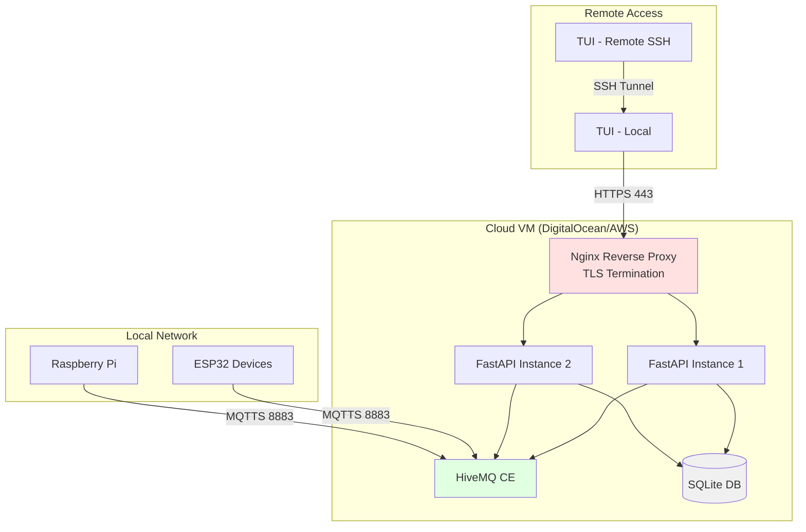

# SmartNest System Architecture

Comprehensive architecture documentation for the SmartNest Home Automation Management System.

**Last Updated:** February 26, 2026 (Post-TUI Implementation)

---

## System Overview

SmartNest is a locally-hosted, privacy-focused home automation platform with three main layers: **Terminal User Interface (TUI)**, **REST API Backend**, and **MQTT Device Network**.



---

## Component Architecture

### 1. Terminal User Interface (TUI)

**Technology:** Python Rich library with live updates

**Main Components:**
- `SmartNestTUI` - Main application class with lifespan management
- `DashboardScreen` - System overview with MQTT live updates
- `DeviceListScreen` - Tabular device listing with filtering/search
- `DeviceDetailScreen` - Device-specific controls (smart lights)
- `SensorViewScreen` - Aggregated sensor data with 24h statistics
- `SettingsScreen` - User management interface

**Responsibilities:**
- Display real-time device status and sensor readings
- Accept user input for device control
- Communicate with backend API via HTTP
- Subscribe to MQTT broker for live updates
- Render rich terminal UI (tables, panels, live updates)

**Key Dependencies:**
- `rich` - Terminal rendering (Console, Live, Table, Panel)
- `httpx` - Synchronous HTTP client for API calls
- `paho-mqtt` - MQTT client for real-time updates
- `SmartNestMQTTClient` - Shared MQTT wrapper

**Data Flow:**


---

### 2. Backend API

**Technology:** FastAPI with async SQLite

**Main Components:**
- `app.py` - FastAPI application with lifespan management
- `routes/devices.py` - Device CRUD endpoints (7 routes)
- `routes/users.py` - User management endpoints (4 routes)
- `repositories/` - Data access layer (Repository pattern)
- `models/` - Pydantic request/response models
- `mqtt_bridge.py` - MQTT-to-Database state synchronization

**Responsibilities:**
- Expose RESTful API for TUI and external clients
- Manage device registry in SQLite database
- Persist sensor readings and device state
- Authenticate and authorize users
- Bridge MQTT messages to database storage
- Generate system reports

**API Endpoints:**

| Endpoint | Method | Description |
|----------|--------|-------------|
| `/api/devices` | GET | List all devices |
| `/api/devices/count` | GET | Get device count |
| `/api/devices/{id}` | GET | Get device by ID |
| `/api/devices/{id}` | PATCH | Update device |
| `/api/devices/{id}` | DELETE | Delete device |
| `/api/devices/{id}/state` | GET | Get device state |
| `/api/devices/{id}/command` | POST | Send device command |
| `/api/devices/bulk` | POST | Bulk device creation |
| `/api/devices/sync-discovered` | POST | Sync discovered devices |
| `/api/users` | GET | List all users |
| `/api/users/{id}` | GET | Get user by ID |
| `/api/users` | POST | Create user |
| `/api/users/{id}` | DELETE | Delete user |
| `/api/sensors/latest` | GET | Latest sensor readings |
| `/api/sensors/stats/24h` | GET | 24-hour sensor statistics |

**Key Dependencies:**
- `fastapi` - Web framework
- `aiosqlite` - Async SQLite driver
- `pydantic` - Data validation and serialization
- `bcrypt` - Password hashing
- `paho-mqtt` - MQTT client for bridge

---

### 3. MQTT Broker

**Technology:** HiveMQ Community Edition (Docker)

**Responsibilities:**
- Message routing between devices, TUI, and backend
- Topic-based publish/subscribe
- Connection management (keep-alive, reconnection)
- Authentication (username/password)

**Configuration:**
- Port: 1883 (unencrypted, development)
- Port: 8080 (Web UI, development)
- Authentication: Enabled (admin/smartnest123)
- Persistence: Enabled (survives restarts)
- Max connections: Unlimited (development)

---

### 4. Device Layer

**Technology:** Python mock devices, future ESP32/Raspberry Pi

**Mock Device Types:**
- `MockSmartLight` - Controllable light (power, brightness, color temp)
- `MockTemperatureSensor` - Periodic temperature readings
- `MockMotionSensor` - Event-driven motion detection

**Responsibilities:**
- Publish sensor readings to MQTT
- Subscribe to command topics
- Execute commands and update state
- Report status and availability
- Participate in device discovery

**Device Lifecycle:**


---

### 5. Database Layer

**Technology:** SQLite with async access (aiosqlite)

**Schema:**

```sql
-- Device Registry
CREATE TABLE devices (
    device_id TEXT PRIMARY KEY,
    name TEXT NOT NULL,
    device_type TEXT NOT NULL,
    mqtt_topic TEXT NOT NULL,
    status TEXT CHECK(status IN ('online', 'offline')) NOT NULL,
    location TEXT,
    last_seen_at TIMESTAMP,
    created_at TIMESTAMP DEFAULT CURRENT_TIMESTAMP,
    updated_at TIMESTAMP DEFAULT CURRENT_TIMESTAMP
);

-- Sensor Readings (30-day retention)
CREATE TABLE sensor_readings (
    id INTEGER PRIMARY KEY AUTOINCREMENT,
    device_id TEXT NOT NULL,
    sensor_type TEXT NOT NULL,
    value REAL NOT NULL,
    unit TEXT,
    timestamp TIMESTAMP DEFAULT CURRENT_TIMESTAMP,
    FOREIGN KEY (device_id) REFERENCES devices(device_id)
);

-- Device State (Current)
CREATE TABLE device_state (
    device_id TEXT PRIMARY KEY,
    state_json TEXT NOT NULL,
    updated_at TIMESTAMP DEFAULT CURRENT_TIMESTAMP,
    FOREIGN KEY (device_id) REFERENCES devices(device_id)
);

-- User Management
CREATE TABLE users (
    id INTEGER PRIMARY KEY AUTOINCREMENT,
    username TEXT UNIQUE NOT NULL,
    email TEXT UNIQUE NOT NULL,
    hashed_password TEXT NOT NULL,
    role TEXT CHECK(role IN ('admin', 'user', 'readonly')) NOT NULL,
    is_active BOOLEAN DEFAULT 1,
    created_at TIMESTAMP DEFAULT CURRENT_TIMESTAMP,
    updated_at TIMESTAMP DEFAULT CURRENT_TIMESTAMP
);

-- System Logs (10,000 most recent)
CREATE TABLE system_logs (
    id INTEGER PRIMARY KEY AUTOINCREMENT,
    level TEXT NOT NULL,
    message TEXT NOT NULL,
    timestamp TIMESTAMP DEFAULT CURRENT_TIMESTAMP,
    correlation_id TEXT
);
```

**Relationships:**
- Devices → Sensor Readings (1:N)
- Devices → Device State (1:1)
- System operates independently per device (no device-to-device dependencies)

---

## MQTT Topic Structure

### Topic Hierarchy

```
smartnest/
├── device/
│   └── {device_id}/
│       ├── command      # Backend → Device (control)
│       └── state        # Device → Backend (updates)
├── sensor/
│   └── {device_id}/
│       └── data         # Device → Backend (readings)
├── discovery/
│   └── announce         # Device → Backend (registration)
└── system/
    └── status           # Backend → All (system health)
```

### Message Flow



---

## Screen Architecture

### TUI Screen Management

The `SmartNestTUI` class manages five screens with shared dependencies:

```python
class SmartNestTUI:
    def __init__(self):
        self.console = Console()           # Shared Rich console
        self.http_client = httpx.Client()  # Shared API client
        self.mqtt_client = SmartNestMQTTClient()  # Shared MQTT client
        
        # Screen instances
        self.dashboard = DashboardScreen(self.console)
        self.device_list = DeviceListScreen(self.console, self.http_client)
        self.device_detail = DeviceDetailScreen(self.console, self.http_client)
        self.sensor_view = SensorViewScreen(self.console, self.http_client)
        self.settings = SettingsScreen(self.console, self.http_client)
        
        # Navigation state
        self.current_screen = "dashboard"
```

### Screen Implementations

All screens follow a consistent pattern:

1. **Initialization:** Accept `Console` and optional `httpx.Client`
2. **Data Fetching:** Async-compatible methods to fetch data from API
3. **Static Rendering:** `render()` method for one-time display
4. **Live Rendering:** `render_live()` returning `rich.console.Group` for live updates
5. **Private Methods:** `_render_*()` methods for each UI section

**Example Screen Pattern:**

```python
class ExampleScreen:
    def __init__(self, console: Console, http_client: httpx.Client):
        self.console = console
        self.http_client = http_client
        self.data: list[dict[str, Any]] = []
    
    def fetch_data(self) -> bool:
        """Fetch data from API, return success status."""
        try:
            response = self.http_client.get("/api/endpoint")
            response.raise_for_status()
            self.data = response.json()
        except Exception:
            self.data = []
            return False
        else:
            return True
    
    def render(self) -> None:
        """Static render - one-time display."""
        success = self.fetch_data()
        self.console.print(self._render_panel(success))
    
    def render_live(self) -> Group:
        """Live render - for Rich Live updates."""
        success = self.fetch_data()
        return Group(
            self._render_panel(success),
            Text(),  # Blank line
            self._render_menu(),
        )
    
    def _render_panel(self, api_success: bool) -> Panel:
        """Private method to render a specific UI section."""
        # Build and return Rich renderable
        pass
```

---

## Data Flow Diagrams

### Device Command Flow



### Sensor Data Flow



### Device Discovery Flow



---

## Component Relationships

### Dependency Graph



### Shared Components

**1. SmartNestMQTTClient (MQTT Wrapper)**
- Used by: TUI, Backend API, Mock Devices
- Provides: Connection management, topic handlers, auto-reconnection
- Protocol: Paho MQTT v2 with 3-parameter callbacks

**2. MQTTConfig (Configuration)**
- Used by: All MQTT clients
- Provides: Broker address, credentials, QoS settings
- Validation: Pydantic BaseModel

**3. Structured Logging**
- Used by: All components
- Provides: Correlation IDs, message catalog, structured context
- Library: structlog with custom processors

---

## Integration Points

### TUI ↔ Backend API

**Protocol:** HTTP/1.1 over localhost

**Request Format:**
```json
POST /api/devices/light_01/command HTTP/1.1
Content-Type: application/json

{
  "command": "set_brightness",
  "parameters": {"brightness": 75}
}
```

**Response Format:**
```json
HTTP/1.1 200 OK
Content-Type: application/json

{
  "device_id": "light_01",
  "success": true,
  "timestamp": "2026-02-26T10:30:00Z"
}
```

### Backend ↔ MQTT Broker

**Protocol:** MQTT 3.1.1

**Command Message:**
```json
Topic: smartnest/device/light_01/command
Payload:
{
  "action": "set_brightness",
  "parameters": {"brightness": 75},
  "timestamp": "2026-02-26T10:30:00Z",
  "user": "admin"
}
```

**State Update:**
```json
Topic: smartnest/device/light_01/state
Payload:
{
  "power": "on",
  "brightness": 75,
  "color_temperature": 3000,
  "timestamp": "2026-02-26T10:30:05Z"
}
```

**Sensor Reading:**
```json
Topic: smartnest/sensor/temp_sensor_01/data
Payload:
{
  "device_id": "temp_sensor_01",
  "sensor_type": "temperature",
  "value": 21.5,
  "unit": "celsius",
  "timestamp": "2026-02-26T10:30:00Z"
}
```

### Backend ↔ Database

**Access Pattern:** Repository Pattern with async/await

**Example:**
```python
async with get_db_connection() as conn:
    repo = DeviceRepository(conn)
    device = await repo.get_by_id("light_01")
    await repo.update_status("light_01", "online")
```

---

## Security Architecture

### Authentication Flow



### Authorization Model

**Roles:**
- `admin` - Full system access (create users, delete devices)
- `user` - Standard access (control devices, view data)
- `readonly` - Read-only access (view dashboard, device list)

**Enforcement:**
- API endpoints: Decorator-based permission checks
- MQTT commands: User field in command payload (logged)
- Database: Role stored in users table

---

## Performance Characteristics

### TUI Rendering

- **Target:** < 100ms response time
- **Actual:** 10-30ms for screen render
- **Live Updates:** 4 FPS (250ms refresh)
- **MQTT Latency:** < 50ms message delivery

### API Response Times

| Endpoint | Avg Response Time |
|----------|-------------------|
| GET /devices | 5-15ms |
| GET /devices/{id} | 2-8ms |
| POST /devices/{id}/command | 20-40ms (includes MQTT publish) |
| GET /sensors/stats/24h | 50-100ms (aggregation query) |

### Database Performance

- **Connection:** Pooled async connections (aiosqlite)
- **Queries:** Indexed on device_id, timestamp
- **Sensor Data:** 30-day retention (auto-cleanup)
- **System Logs:** 10,000 most recent entries (circular buffer)

---

## Scalability Considerations

### Current Limits (Phase 1)

- **Devices:** 50-100 devices (SQLite single-file)
- **Sensor Readings:** 10,000/hour (30-day retention = 7.2M max)
- **Concurrent Users:** 5-10 TUI sessions
- **MQTT Messages:** 1,000/second (HiveMQ CE limit)

### Future Scaling Options

- **Database:** Migrate to PostgreSQL for 500+ devices
- **MQTT:** Cluster HiveMQ Enterprise for 10,000+ devices
- **API:** Add horizontal scaling with load balancer
- **Caching:** Redis for frequently accessed state

---

## Deployment Architecture (Future)



---

## Technology Decisions

### Why Python?

- **Async Support:** First-class `async`/`await` for I/O operations
- **Rich Ecosystem:** FastAPI, Rich, Pydantic, pytest
- **Cross-Platform:** TUI works on Windows, Linux, macOS
- **Rapid Development:** Fast iteration for capstone timeline

### Why FastAPI?

- **Async Native:** Non-blocking I/O for MQTT and database
- **Auto Documentation:** OpenAPI spec generation
- **Type Safety:** Pydantic integration for validation
- **Modern Standards:** WebSockets (future), dependency injection

### Why SQLite?

- **Serverless:** No separate database process
- **Portable:** Single-file database (easy backup)
- **Sufficient:** 50-100 devices well within limits
- **Async Support:** aiosqlite for non-blocking access

### Why HiveMQ CE?

- **Production-Ready:** Battle-tested broker
- **Standards Compliant:** Full MQTT 3.1.1 support
- **Web UI:** Built-in monitoring dashboard
- **Docker-Friendly:** Official container images

### Why Rich (TUI)?

- **Modern Rendering:** Cross-platform terminal support
- **Live Updates:** Built-in live display with refresh
- **Batteries Included:** Tables, panels, progress bars
- **Easy Testing:** Mock Console for unit tests

---

## Trade-offs and Limitations

### Current Limitations

1. **Single-Process TUI:** No multi-user terminal sharing
2. **SQLite Concurrency:** Write serialization (acceptable for 5-10 users)
3. **No Real-Time Push:** TUI polls API, relies on MQTT for live updates
4. **Basic Authentication:** JWT tokens, no OAuth/SSO
5. **Local-First:** Requires VPN or SSH for remote access

### Future Enhancements

1. **WebSocket Support:** Replace polling with push notifications
2. **Web UI:** React/Vue frontend alongside TUI
3. **PostgreSQL Migration:** For 500+ devices
4. **HiveMQ Enterprise:** MQTT clustering for high availability
5. **OAuth Integration:** Google/GitHub SSO

---

## Development Patterns

### Repository Pattern

**Purpose:** Decouple database access from business logic

**Example:**
```python
class DeviceRepository:
    def __init__(self, conn: aiosqlite.Connection):
        self.conn = conn
    
    async def get_by_id(self, device_id: str) -> DeviceResponse | None:
        async with self.conn.execute(
            "SELECT * FROM devices WHERE device_id = ?", (device_id,)
        ) as cursor:
            row = await cursor.fetchone()
            return self._row_to_response(row) if row else None
```

### Pydantic Models

**Purpose:** Type-safe API contracts with validation

**Example:**
```python
class DeviceCreate(BaseModel):
    device_id: str = Field(..., min_length=1, max_length=100)
    name: str = Field(..., min_length=1, max_length=200)
    device_type: DeviceType
    location: str | None = Field(None, max_length=200)
    
    @field_validator("device_id")
    @classmethod
    def validate_device_id(cls, v: str) -> str:
        if not v.replace("_", "").replace("-", "").isalnum():
            raise ValueError("device_id must be alphanumeric")
        return v
```

### Structured Logging

**Purpose:** Consistent, parseable log messages with stable codes

**Example:**
```python
from backend.logging import log_with_code, MessageCode

log_with_code(
    logger,
    "info",
    MessageCode.MQTT_DEVICE_CONNECTED,
    device_id="light_01",
    client_id="smartnest_tui",
)
```

---

## Testing Strategy

### Unit Tests (721 tests)

- **Isolation:** Mock external dependencies (MQTT, HTTP, DB)
- **Coverage:** 100% statement and branch coverage
- **Assertions:** Behavior verification, not implementation details

### Integration Tests (22 tests)

- **Real Dependencies:** Actual SQLite, HiveMQ broker (test instance)
- **Scenarios:** Full request/response cycles
- **Data Persistence:** Verify database state after operations

### Mutation Tests (97.5% score)

- **Tool:** mutmut (requires WSL on Windows)
- **Target:** ≥97% mutation score
- **Process:** Kill mutants with tests, accept surviving low-priority mutants

**See:** [docs/tui_developer_guide.md](tui_developer_guide.md) for detailed testing patterns.

---

## Monitoring and Observability

### Logging Levels

- **DEBUG:** MQTT message traffic, internal state changes
- **INFO:** Lifecycle events (startup, shutdown, connections)
- **WARNING:** Recoverable errors (reconnection, API timeouts)
- **ERROR:** Unrecoverable errors (database corruption, invalid config)

### Metrics (Future)

- Device uptime percentage
- Sensor reading frequency
- API response time histograms
- MQTT message throughput
- Error rates by component

---

## References

- [TUI Developer Guide](tui_developer_guide.md) - Screen implementation patterns
- [Device Implementation Guide](device_implementation_guide.md) - Creating mock devices
- [Discovery Protocol Spec](discovery_protocol.md) - Device registration protocol
- [Mutation Testing Guide](mutation_testing.md) - Mutation testing workflow

---

**Project:** SmartNest Home Automation Management System  
**Developer:** Krystian Spiewak  
**Course:** SDEV435 - Capstone Project  
**Institution:** Champlain College
